# 不太快的快速开始

如果想要知道其他功能的使用方式, 可以再看看其他的 (。・ω・。)

## 设置

首先点开界面右下角的小螺母, 展开设置界面

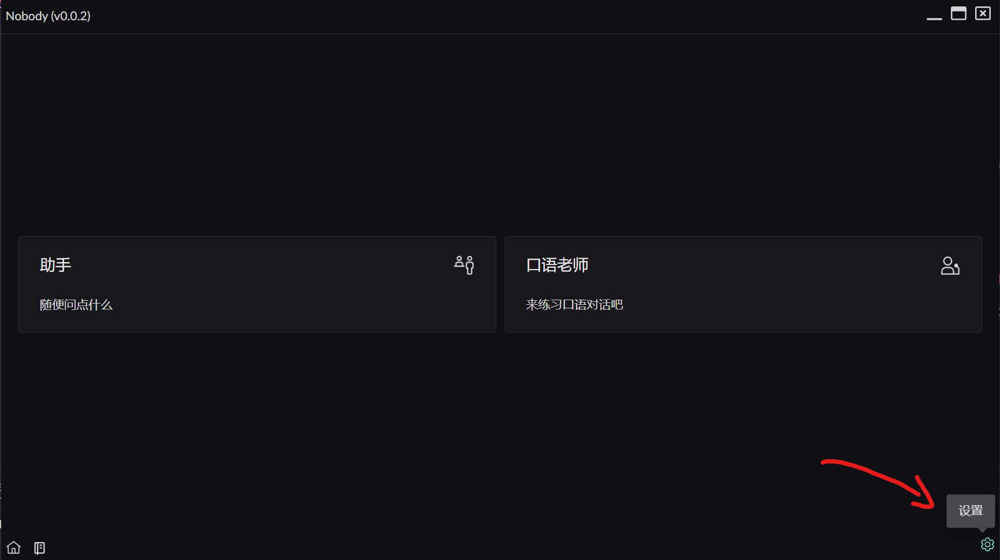{data-zoomable}

接着将 `API KEY` 以及 `服务器地址` 填入设置

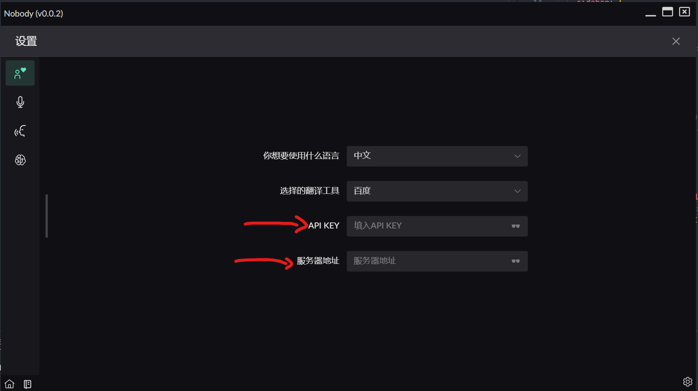{data-zoomable}

点击底部的 `主页`, 这样就可以回到主页了

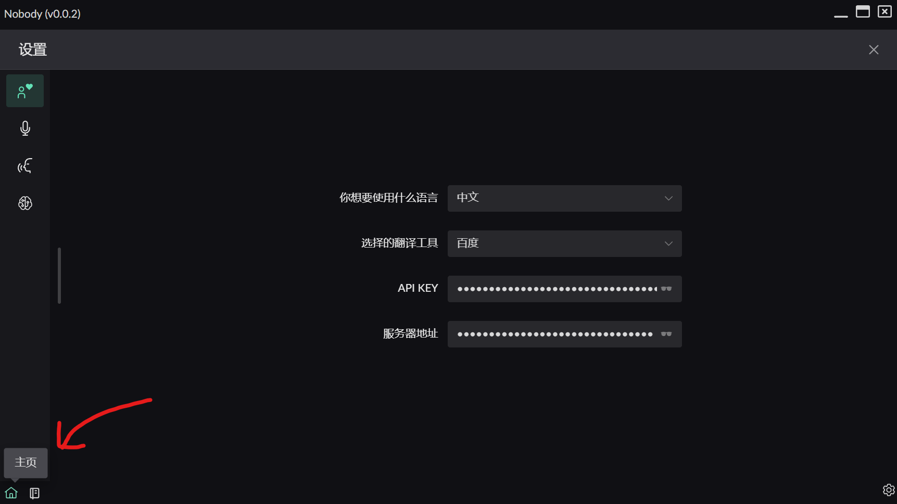{data-zoomable}

## 新建会话

点击想要开始的会话类型, 进入创建会话界面

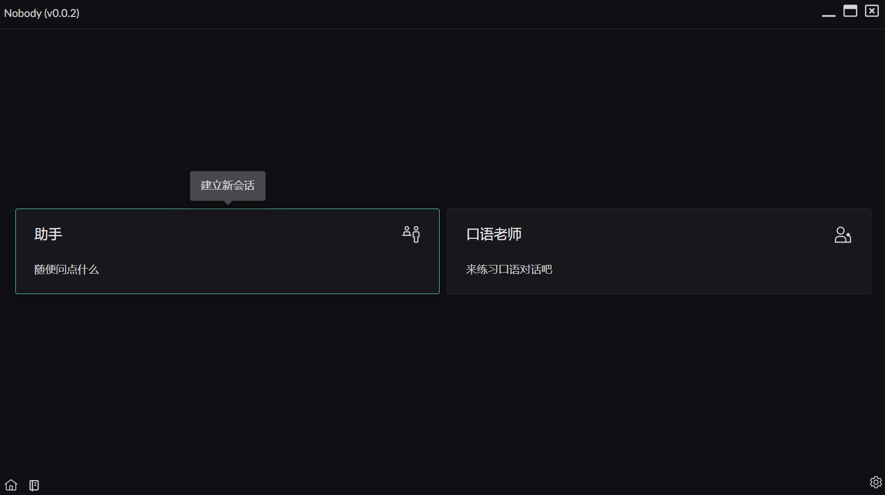{data-zoomable}

界面分为左右两个部分:
* 左侧为历史会话
* 右侧是这次建立的会话设置

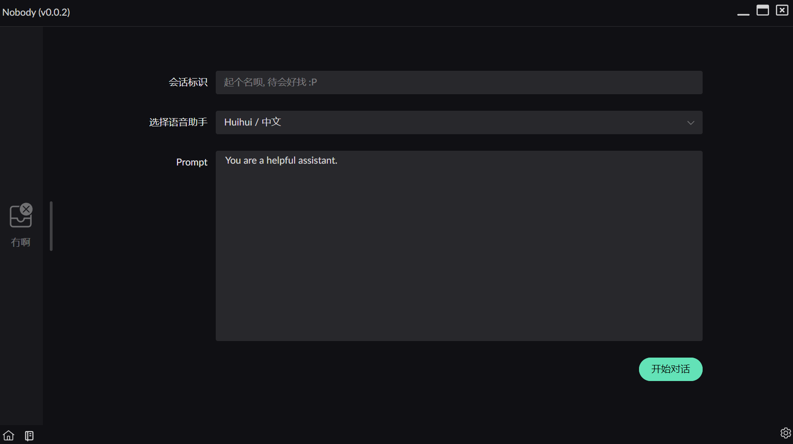{data-zoomable}

建立会话的界面中有这几个空:
* 会话标识: 选填(但是还是填一下) 用于后续查看容易分辨
* 选择语音助手: 对话中可以进行朗读, 相当于选择朗读的语音音色(PS: [添加更多音色](/setting/speech.md#添加其他语音))
* Prompt: 提示, 这个框是不可编辑的, 只是展示当前使用的 Prompt 现在你可以不用管

所以, 请填写 `会话标识` 然后点击界面中的 `开始对话` 按钮, 进入对话吧.

## 界面介绍
点击按钮后是这样的界面

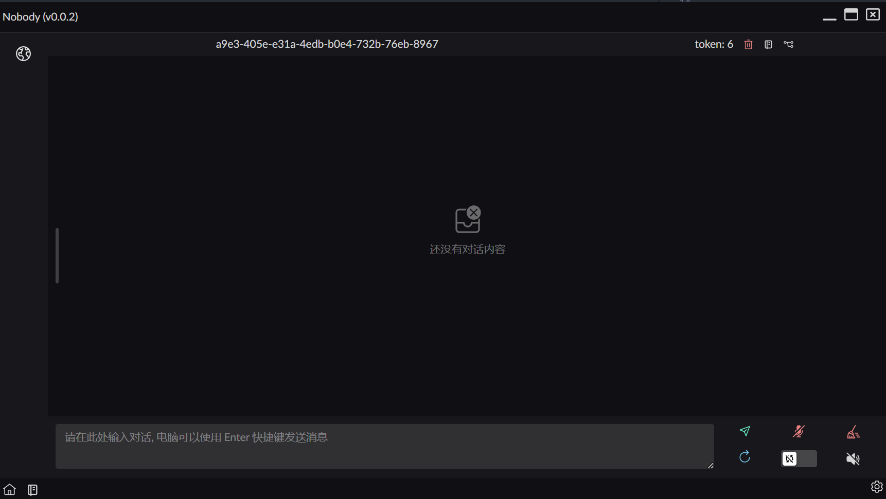{data-zoomable}

首先特别显眼的是 `a9e3-405e-e31a-4edb-b0e4-732b-76eb-8967` 这展示的是会话的标识, 也就是说如果之前你并没有输入**会话标识**, 那么将会展示的就是类似这串的数字. 

会话标识后的一系列内容分别是:
* 当前对话的 **token** 数 (并不是对整个会话的统计, 而是你进行对话时除了你输入的文本外的 token 数量)
  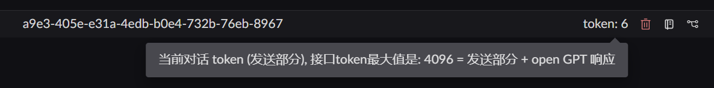{data-zoomable}
* 删除当前对话的按钮: 点击之后会有一个确认
  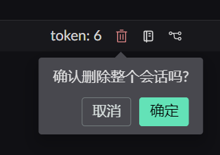{data-zoomable}
* 打开当前对话的笔记: 只会展示当前对话你记录的笔记
* 当前对话的分支图: 切换当前聊天的分支和管理分支(听不懂没关系, 后续会介绍)

下面的按钮会多一些
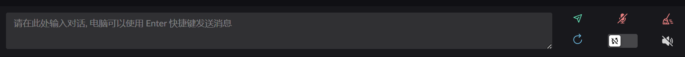{data-zoomable}

左侧不用说, 是你输入文字的地方.
右侧的按钮从左到右, 从上到下分别是:
* 发送消息
* 启用/关闭麦克风
* 清空对话
* 重试
* 是否在语音结束后自动发送(默认是3秒 / 可以在 [设置](/setting/recognition.md) 中修改)
  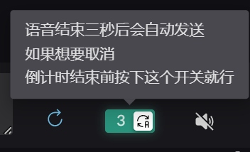{data-zoomable}
* 停止正在进行的朗读

## 开始对话
总算是可以开始对话了 😅

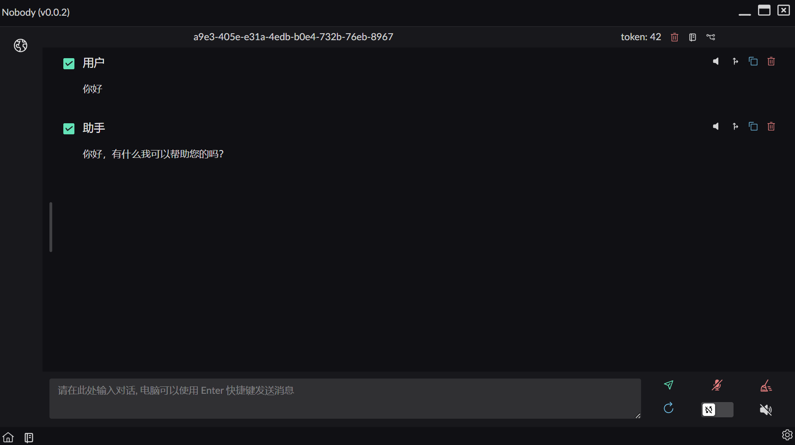{data-zoomable}

每个对话的右侧, 都有一些按钮, 这些按钮分别是:
* 朗读: 用之前所选的语音助手音色进行朗读
* 分叉: 从当前回答进行分支
* 复制: 复制消息内容
* 删除: 删除这个消息

选中对话中的文本, 还有额外的功能菜单
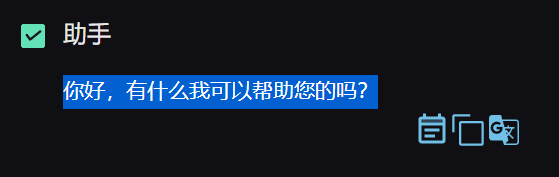{data-zoomable}
从左往右分别是
* 创建笔记: 记录想要的文本, 详情见 [笔记](/note)
  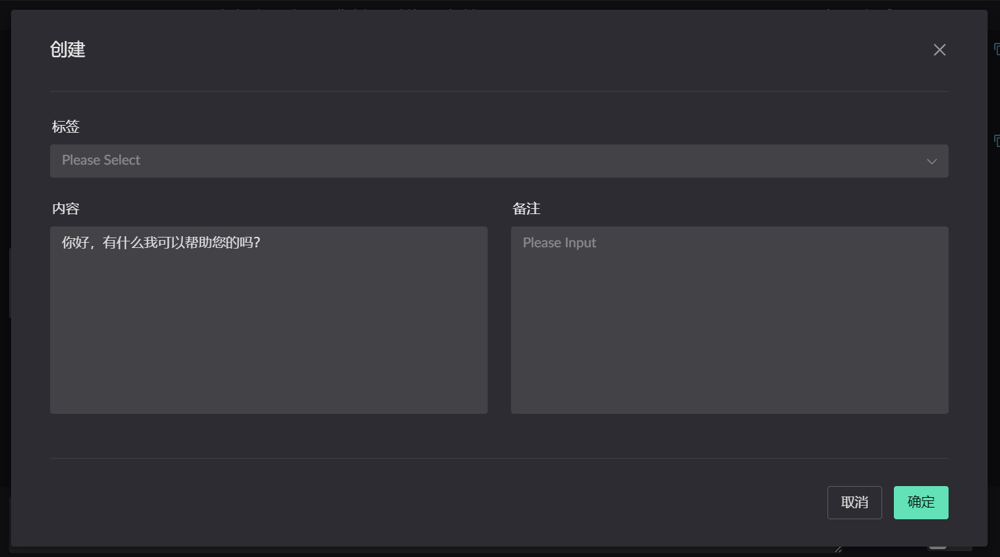{data-zoomable}
* 复制: 只复制选中的文本
* 翻译: 打开外部的网页进行对选中的文字进行翻译
  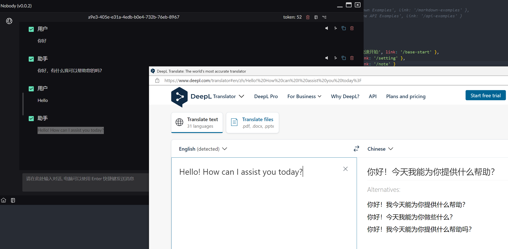{data-zoomable}

## 结束
如果想了解其他内容, 可以看看其他的.
