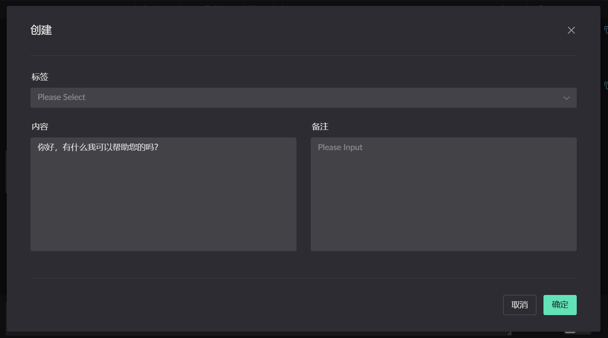
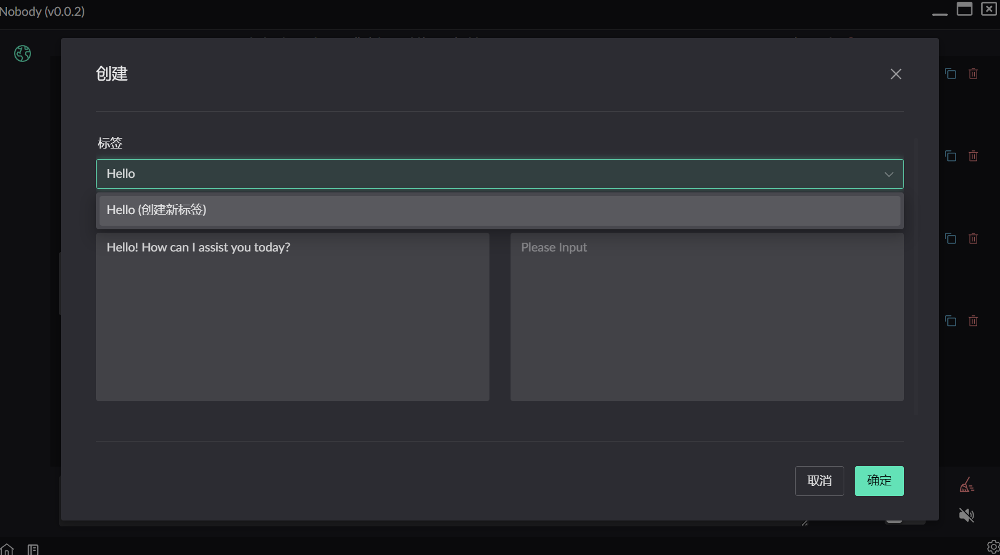
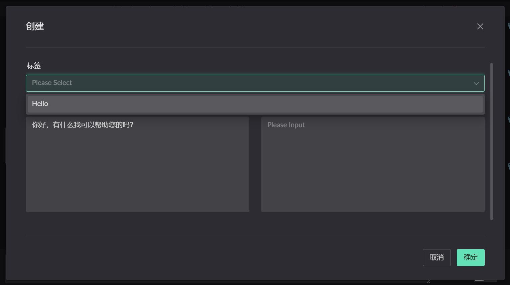
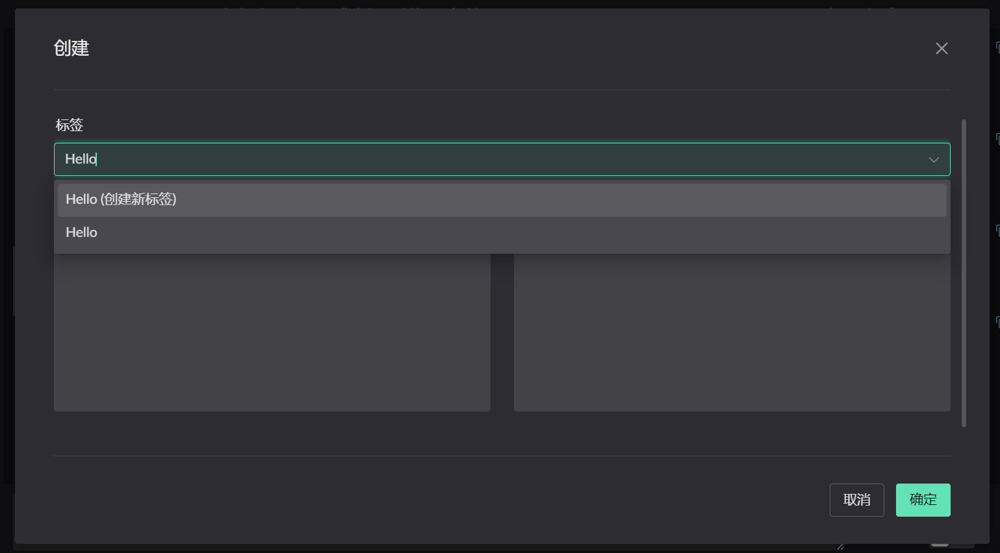
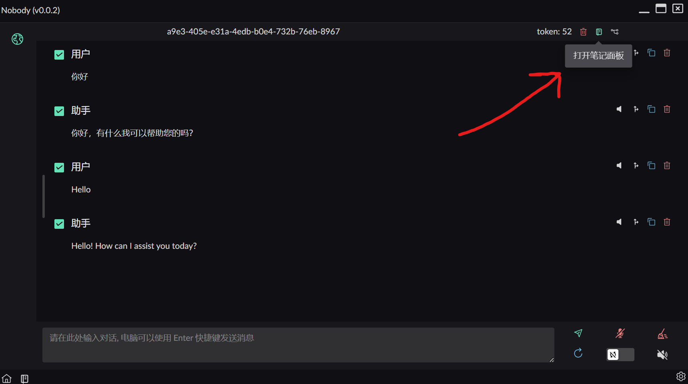
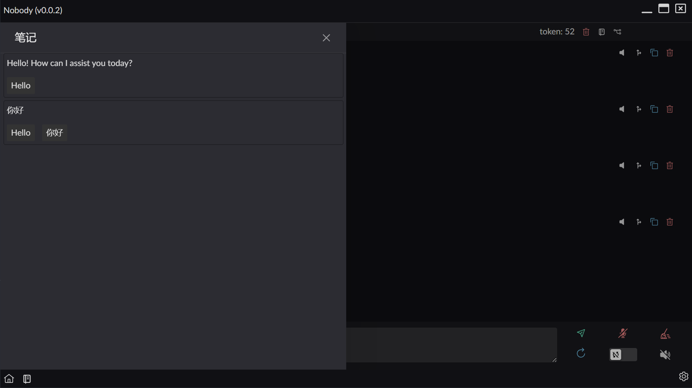
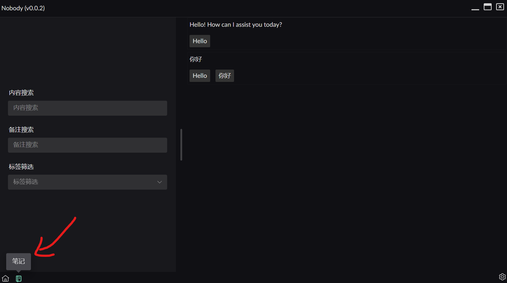

# 笔记
哦, 上帝. 让我看看我都记了啥

## 创建笔记
当在聊天时, 可能会遇到你想要记录的内容, 那么这时笔记就派上用场了 ! ! !

{data-zoomable}

创建笔记有以下几个内容: 标签 / 内容 / 备注

* 内容就是你要记录的内容
* 备注是你为内容添加的备注

## 标签
`标签` 是用来标记 `笔记` 的 ~~我标记了一个敌人~~, 创建的标签所有笔记都可以使用.

那么问题来了, 在哪里创建呢? 输入文本选择就行!

{data-zoomable}
点击确定, 笔记就创建好了

创建新笔记时可以使用之前新建的标签
{data-zoomable}

::: warning
因为输入文字就能创建标签, 所以选择已有标签时要小心, 不要创建重复的标签.
{data-zoomable}
:::

## 查看当前会话的笔记
如果想要查看当前的会话记录了什么, 点击会话的 *笔记面板按钮*, 就可以看到了

{data-zoomable}

{data-zoomable}

## 查看所有笔记
在底部可以看到一个笔记按钮, 点击就可以看见. 这样的界面

{data-zoomable}

左边是对笔记的筛选, 右边展示的是筛选后的笔记内容

## 未做的功能
- [ ] 可以从全局笔记回到具体的会话
- [ ] ...待添加

